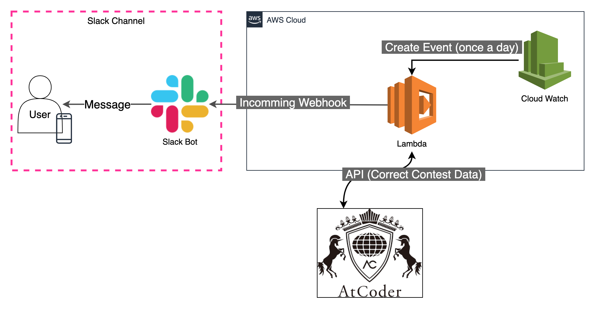

# slackDevotion

slack Bot for devotion

## Description

As part of Slack's Cloud Watch event, once a day, you'll receive a report on the channel with the problems you've solved.

### system configuration

## How to use

After setting up the lambda function, you need to set up the Cloud Watch event. You will also need to create a slack app separately.

## API

use this in lambda function (Non-formula API)

- https://github.com/kenkoooo/AtCoderProblems/blob/master/doc/api.md

Thank you for Mr.[kenkoooo](https://github.com/kenkoooo) for API
